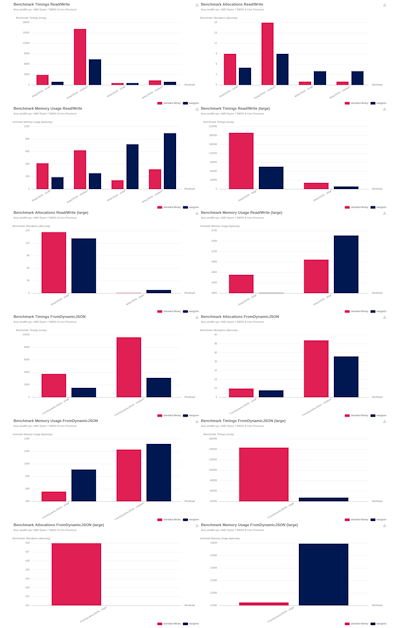

# benchviz

<!-- Badges: status  -->
[![Tests][test-badge]][test-url] [![Coverage][cov-badge]][cov-url] [![CI vuln scan][vuln-scan-badge]][vuln-scan-url] [![CodeQL][codeql-badge]][codeql-url]
<!-- Badges: release & docker images  -->
<!-- Badges: code quality  -->
<!-- Badges: license & compliance -->
[![Release][release-badge]][release-url] [![Go Report Card][gocard-badge]][gocard-url] [![CodeFactor Grade][codefactor-badge]][codefactor-url] [![License][license-badge]][license-url]
<!-- Badges: documentation & support -->
<!-- Badges: others & stats -->
[![GoDoc][godoc-badge]][godoc-url] [![go version][goversion-badge]][goversion-url] ![Top language][top-badge] ![Commits since latest release][commits-badge]

A rendering tool for go benchmarks.



## Install

```sh
go install github.com/fredbi/benchviz@latest
```

## Features

`benchviz` happily slurps output from your go benchmarks (text or JSON),
and renders them as nice bar charts on a single page.

The output format may be a HTML page or a PNG screenshot of that page.

## Requirements

`go1.25`

When producing images, `chromedp` must be installed locally.
See <https://github.com/chromedp/chromedp#frequently-asked-questions>.

## Concepts

So this is a chart drawing utility, with some pre-baked logic specifically targeted at
rendering benchmark data.

A YAML configuration allows for different rendering scenarios.

We rearrange raw measurements into series to be rendered as bar charts.

1. Metrics: represent which benchmark measurement to be displayed.
   Usually, a single metric is displayed on a given chart.
   Dual-scale charts displaying 2 metrics on the same chart is supported on option.
2. Functions: represent which measurement series to extract.
   Functions are identified by regular expressions.
3. Categories: represent an individual chart on the page. You may pack several such charts on the same page.
   A category is a bundle of (functions x contexts x versions).
4. Context: criterion to build the points of a single series displayed as a bar chart.
   Examples: you may want to render the performance of a given function under different workloads.
5. Version: criterion to render series side by side.
   Examples: you may want to render side by side 2 different versions of the same function,
   or runs on different environments.

All these items may get a customized title.

## Layout options

* theme
* bar chart layout: horizontal or vertical bars
* axis labels
* legend

## [Examples](./examples)

## Acknowledgements

This tool leverages two fantastic libraries.

1. To build charts:
  ```
	github.com/go-echarts/go-echarts/v2 v2.6.7
  ```
2. To take screenshots of a HTML page

  ```
	github.com/chromedp/chromedp 
  ```

<!-- Badges: status  -->
[test-badge]: https://github.com/fredbi/benchviz/actions/workflows/go-test.yml/badge.svg
[test-url]: https://github.com/fredbi/benchviz/actions/workflows/go-test.yml
[cov-badge]: https://codecov.io/gh/fredbi/benchviz/branch/master/graph/badge.svg
[cov-url]: https://codecov.io/gh/fredbi/benchviz
[vuln-scan-badge]: https://github.com/fredbi/benchviz/actions/workflows/scanner.yml/badge.svg
[vuln-scan-url]: https://github.com/fredbi/benchviz/actions/workflows/scanner.yml
[codeql-badge]: https://github.com/fredbi/benchviz/actions/workflows/codeql.yml/badge.svg
[codeql-url]: https://github.com/fredbi/benchviz/actions/workflows/codeql.yml
<!-- Badges: release & docker images  -->
[release-badge]: https://badge.fury.io/gh/fredbi%2Fbenchviz.svg
[release-url]: https://badge.fury.io/gh/fredbi%2Fbenchviz
[gomod-badge]: https://badge.fury.io/go/github.com%2Ffredbi%2Fbenchviz.svg
[gomod-url]: https://badge.fury.io/go/github.com%2Ffredbi%2Fbenchviz
<!-- Badges: code quality  -->
[gocard-badge]: https://goreportcard.com/badge/github.com/fredbi/benchviz
[gocard-url]: https://goreportcard.com/report/github.com/fredbi/benchviz
[codefactor-badge]: https://img.shields.io/codefactor/grade/github/fredbi/benchviz
[codefactor-url]: https://www.codefactor.io/repository/github/fredbi/benchviz
<!-- Badges: documentation & support -->
[godoc-badge]: https://pkg.go.dev/badge/github.com/fredbi/benchviz
[godoc-url]: http://pkg.go.dev/github.com/fredbi/benchviz

<!-- Badges: license & compliance -->
[license-badge]: http://img.shields.io/badge/license-MIT-orange.svg
[license-url]: https://github.com/fredbi/benchviz/?tab=MIT-1-ov-file#readme
<!-- Badges: others & stats -->
[goversion-badge]: https://img.shields.io/github/go-mod/go-version/fredbi/benchviz
[goversion-url]: https://github.com/fredbi/benchviz/blob/master/go.mod
[top-badge]: https://img.shields.io/github/languages/top/fredbi/benchviz
[commits-badge]: https://img.shields.io/github/commits-since/fredbi/benchviz/latest
